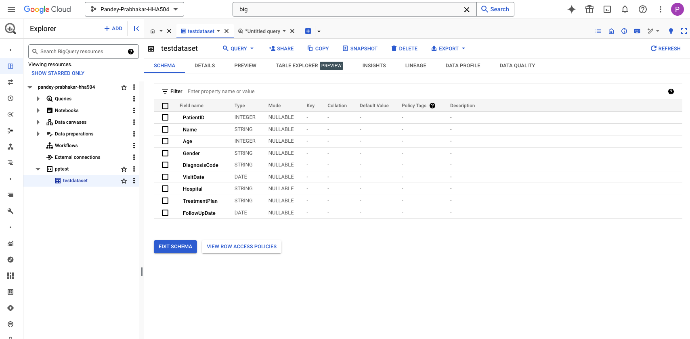
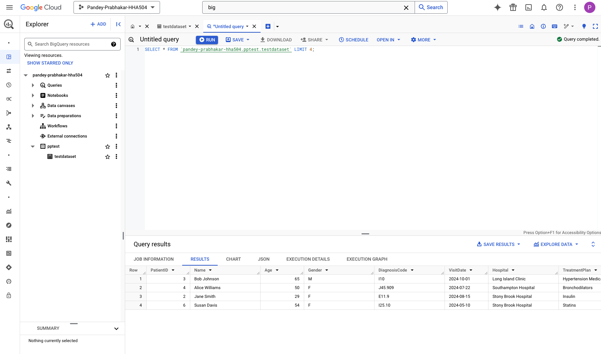
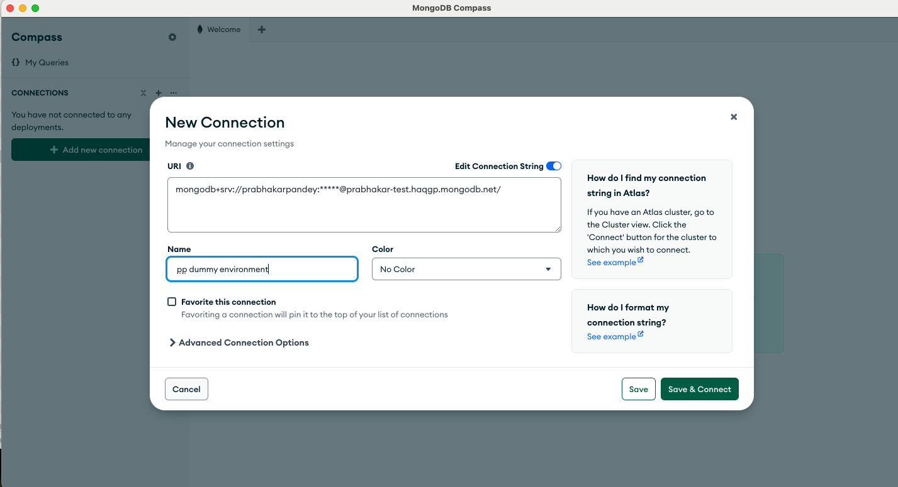
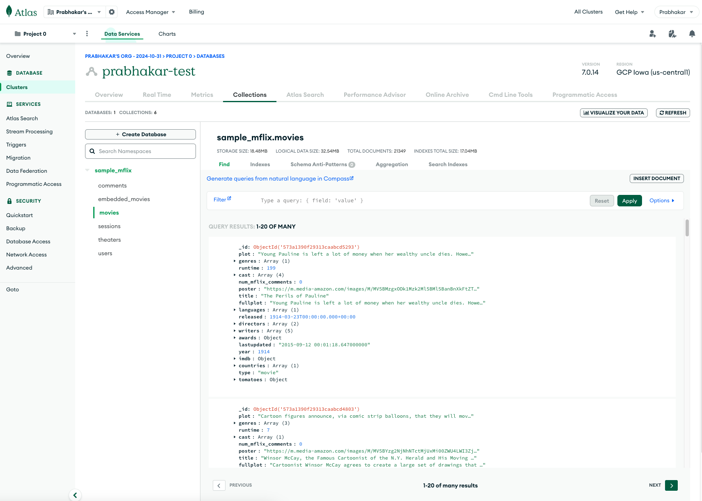
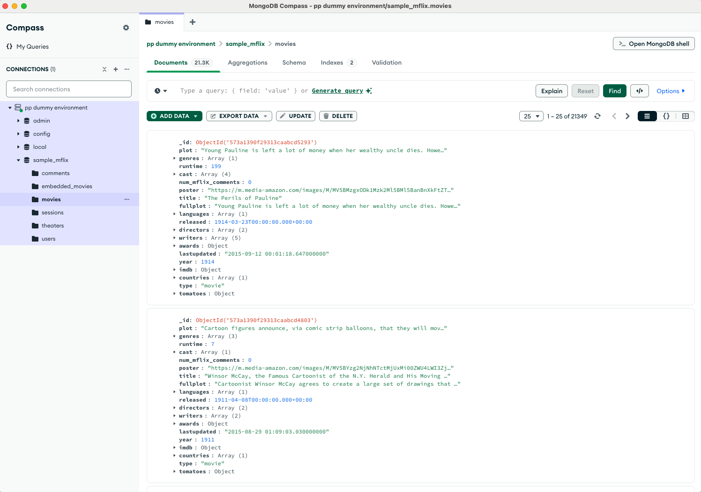
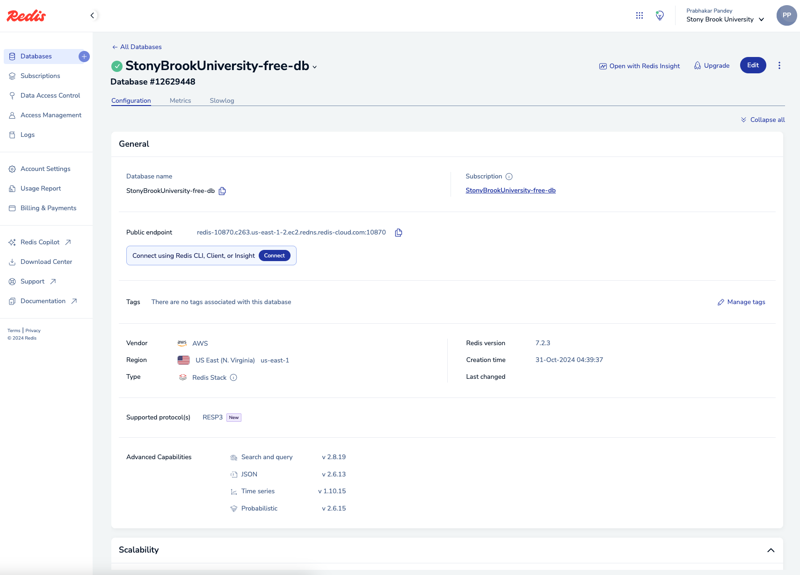
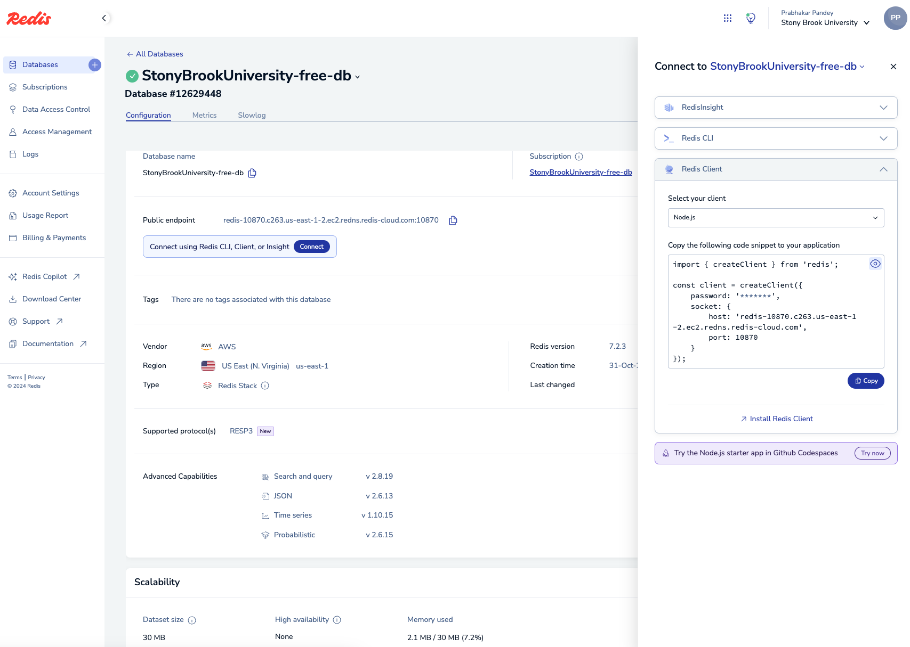
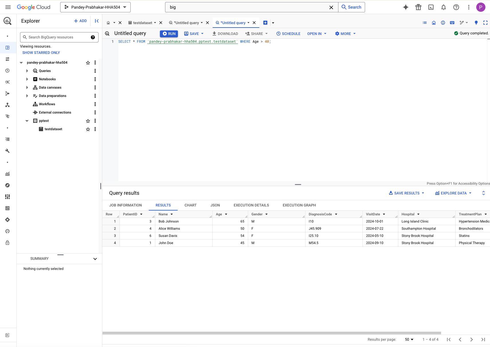
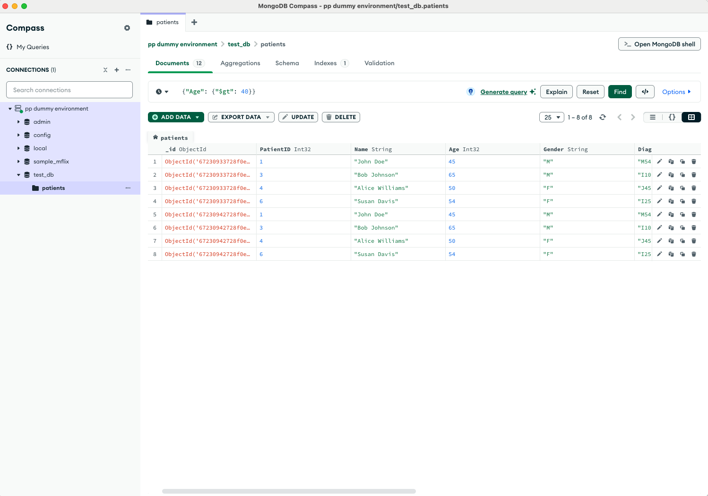

## Objective
The objective of this assignment is to introduce you to managed database services in Azure and Google Cloud Platform (GCP). You will learn how to start, stop, and monitor database-related services, including BigQuery and MySQL.

## Fake dataset to use: 

- data set url: [https://raw.githubusercontent.com/hantswilliams/HHA-504-2024/refs/heads/main/other/module8/module8_nosql_hw.csv](https://raw.githubusercontent.com/hantswilliams/HHA-504-2024/refs/heads/main/other/module8/module8_nosql_hw.csv)

### 1. Start and Configure Databases
- **Google BigQuery (GCP):**
    
    

- **MongoDB Atlas (Cloud):**
    
    
    

- **Redis Cloud:**
    
    

### 2. Explore BigQuery (GCP)
- **BigQuery:**
    

### 3. Modify and Explore the Data in MongoDB Atlas and Redis Cloud
- **MongoDB Atlas**:
    

- **Redis Cloud**:
    Please refer to the Python file

### 4. Describe Your Experience

  All three platforms were fairly easy to work with. With BigQuery, I felt like I was interacting with only one interface. Loading the data and running the queries was super easy. With MongoDB and Redis, I had to create the database and take into account various connection requirements. While MongoDB just required to copy the URL with a single line of code, Redis required the portnumber, host, etc. separately. I installed the appropriate packages and I was able to connect to MongoDB and Redis. I installed MongoDB compass and ran simple query there. I added the dataset to Redis using Python and made some updates there. 
